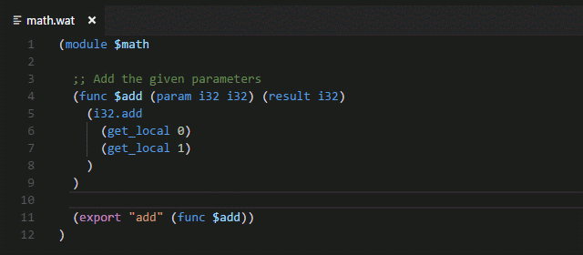
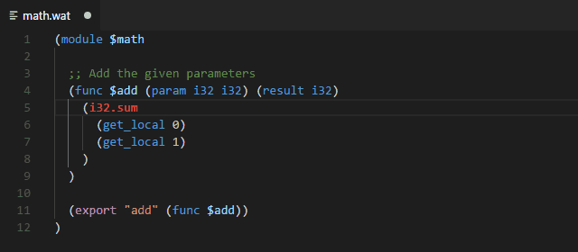

# WebAssembly Syntax for Visual Studio Code

Syntax highlighting for the WebAssembly textual format (.wat).

## Features

Syntax highlighting.

Error highlighting.

## Release Notes

### [0.2.0] - 2018-05-05

- Changed logo.

### [0.1.0] - 2018-05-05

- Initial release.
